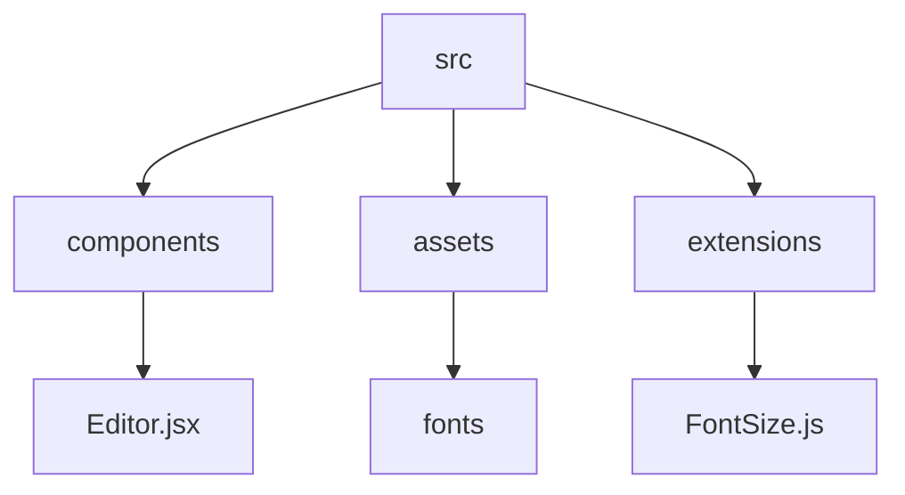

# T-Editor: A Rich Text Editor Built with Tiptap and React

## 🗂️ Description

T-Editor is a customizable rich text editor built using Tiptap and React. It's designed for developers who want to integrate a feature-rich text editor into their web applications. With T-Editor, you can create and edit rich text content with various formatting options, including bold, italic, strike-through, and highlight, as well as font family and size controls.

T-Editor is perfect for applications that require a high degree of customization and flexibility, such as content management systems, blogging platforms, and online documentation tools.

## ✨ Key Features

### **Editor Features**

* Rich text formatting options: bold, italic, strike-through, highlight, and more
* Font family and size controls
* Undo/redo functionality
* Image uploading and management
* Customizable toolbar buttons

### **Technical Features**

* Built with Tiptap and React
* Uses Vite as the build tool
* Supports ESLint for code linting
* Customizable extensions and plugins

## 🗂️ Folder Structure

## 🛠️ Tech Stack

## ⚙️ Setup Instructions

To run T-Editor locally, follow these steps:

* Clone the repository: `git clone https://github.com/oneWritesCode/T-Editor.git`
* Install dependencies: `npm install`
* Start the development server: `npm run dev`
* Open your browser and navigate to `http://localhost:5173`

## 📁 Configuration Files

* `vite.config.js`: Configuration file for Vite
* `eslint.config.js`: Configuration file for ESLint
* `package.json`: Project metadata and dependencies

## 🤔 GitHub Actions

This repository uses GitHub Actions for automated testing and deployment. The workflow is defined in the `.github/workflows/main.yml` file.

## 📝 Editor Customization

To customize the editor, you can create your own extensions and plugins using Tiptap's API. For example, you can create a custom font size extension by creating a new file in the `src/extensions` directory and importing it in the `src/Components/Editor.jsx` file.

## 🖋️ Fonts

The repository includes several font files, including Funnel Sans, Mogra, Sour Gummy, Bonheur Royale, and Alumni Sans Pinstripe. These fonts are used in the editor for font family and size controls.

  

<h3>deepak</h3>

Passionate developer striving for flawlessness in code and craft.

 

  <a href="https://gitfull.vercel.app">Made by GitFull</a>

    