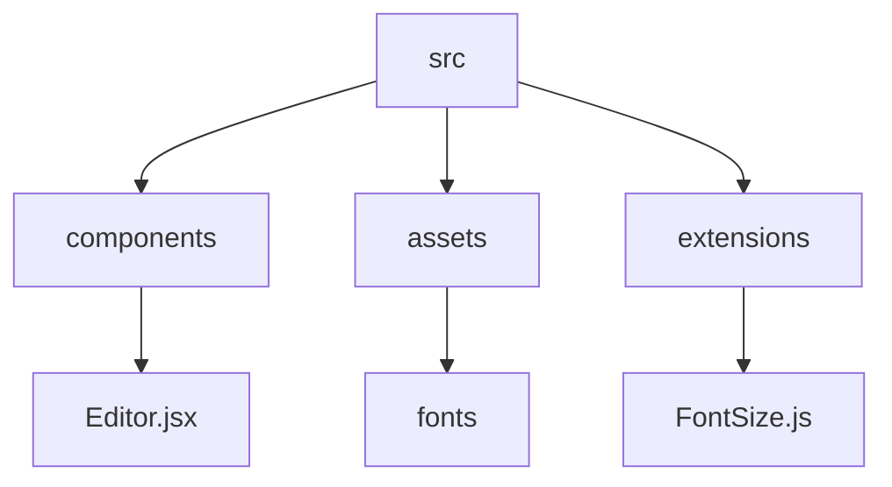

# T-Editor: A Rich Text Editor Built with React and Tiptap

## 🗂️ Description

T-Editor is a rich text editor built with React and Tiptap, designed to provide a seamless editing experience. This project is ideal for developers who want to integrate a customizable text editor into their applications. With T-Editor, you can create and edit rich text content with various formatting options.

T-Editor is built with a modular architecture, making it easy to extend and customize. The editor is designed to be highly configurable, allowing developers to add or remove features as needed.

## ✨ Key Features

### **Editor Features**

* Rich text editing with various formatting options (font family, font size, color, etc.)
* Customizable toolbar with buttons for undo, redo, and other editing actions
* Support for multiple font families and sizes

### **Technical Features**

* Built with React and Tiptap
* Modular architecture for easy customization and extension
* Highly configurable

## 🗂️ Folder Structure

## 🛠️ Tech Stack

## ⚙️ Setup Instructions

To run T-Editor locally, follow these steps:

* Clone the repository: `git clone https://github.com/oneWritesCode/T-Editor.git`
* Install dependencies: `npm install` or `yarn install`
* Start the development server: `npm run dev` or `yarn dev`

## 📦 GitHub Actions

T-Editor uses GitHub Actions for continuous integration and deployment. The workflow is defined in the `.github/workflows/main.yml` file.

## 📝 Editor Configuration

The editor configuration is defined in the `src/Components/Editor.jsx` file. You can customize the editor by adding or removing features, and modifying the toolbar buttons.

## 📚 Fonts

T-Editor includes several font families, including Funnel Sans, Mogra, Sour Gummy, Bonheur Royale, and Alumni Sans Pinstripe. You can find more information about each font in the `src/assets/Fonts` directory.

  

<h3>deepak</h3>

Self-taught web developer.

 

  <a href="https://gitfull.vercel.app">Made by GitFull</a>

    
