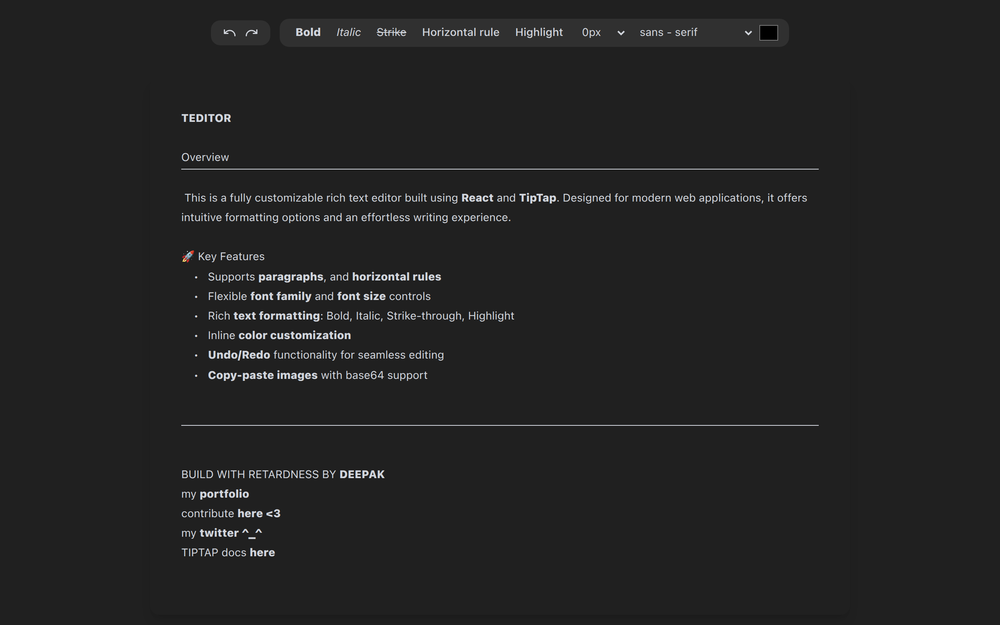
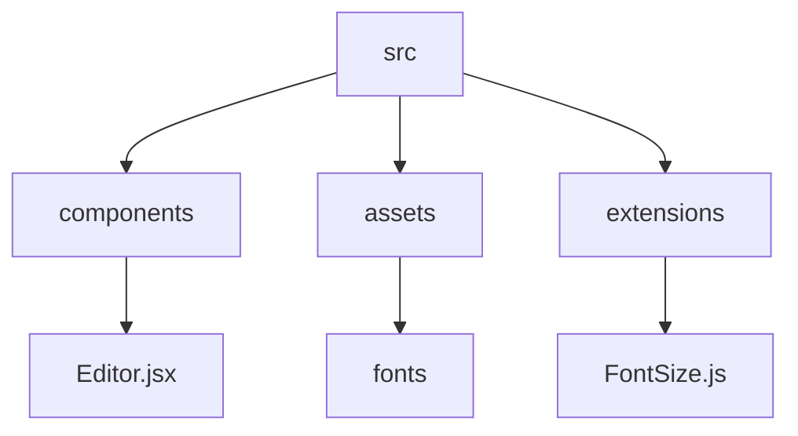

# T-Editor: A Rich Text Editor Built with React and Tiptap

## 🗂️ Description

T-Editor is a rich text editor built with React and Tiptap, designed to provide a seamless editing experience. This project is perfect for developers who want to integrate a customizable and feature-rich editor into their applications. With T-Editor, users can format text, upload images, and enjoy a range of font families.

## ✨ Key Features

### **Editor Features**

* Rich text editing with font family, font size, and text color options
* Bold, italic, strike-through, and highlight formatting
* Undo/redo functionality
* Image uploading and management
* Customizable font families

### **Technical Features**

* Built with React and Tiptap
* Utilizes Vite as the development server and bundler
* Supports Tailwind CSS for styling
* Integrates ESLint for code linting

## 🗂️ Folder Structure

## 🛠️ Tech Stack

## ⚙️ Setup Instructions

To run T-Editor locally, follow these steps:

* Clone the repository: `git clone https://github.com/abhraneeldhar7/T-Editor.git`
* Install dependencies: `npm install` or `yarn install`
* Start the development server: `npm run dev` or `yarn dev`
* Open your browser and navigate to `http://localhost:5173`

## 📁 GitHub Actions

This repository uses GitHub Actions to automate tasks. The workflow files are located in the `.github/workflows` directory.

## 🤝 Code Quality

T-Editor uses ESLint to maintain code quality and enforce coding standards. The ESLint configuration file is located at `eslint.config.js`.

## 📚 Fonts

T-Editor includes several font families, each with its own license and documentation. The fonts are located in the `src/assets/Fonts` directory.

## 💻 Contributing

While contributions are not currently accepted, feel free to fork the repository and modify it to suit your needs. If you have any questions or issues, please open an issue on the repository.

  

<h3>Abhra the Neel</h3>

Full-stack developer with expertise in web, Android, and server-side development. Most projects are private due to being production code.

 

  <a href="https://gitfull.vercel.app">Made by GitFull</a>

    